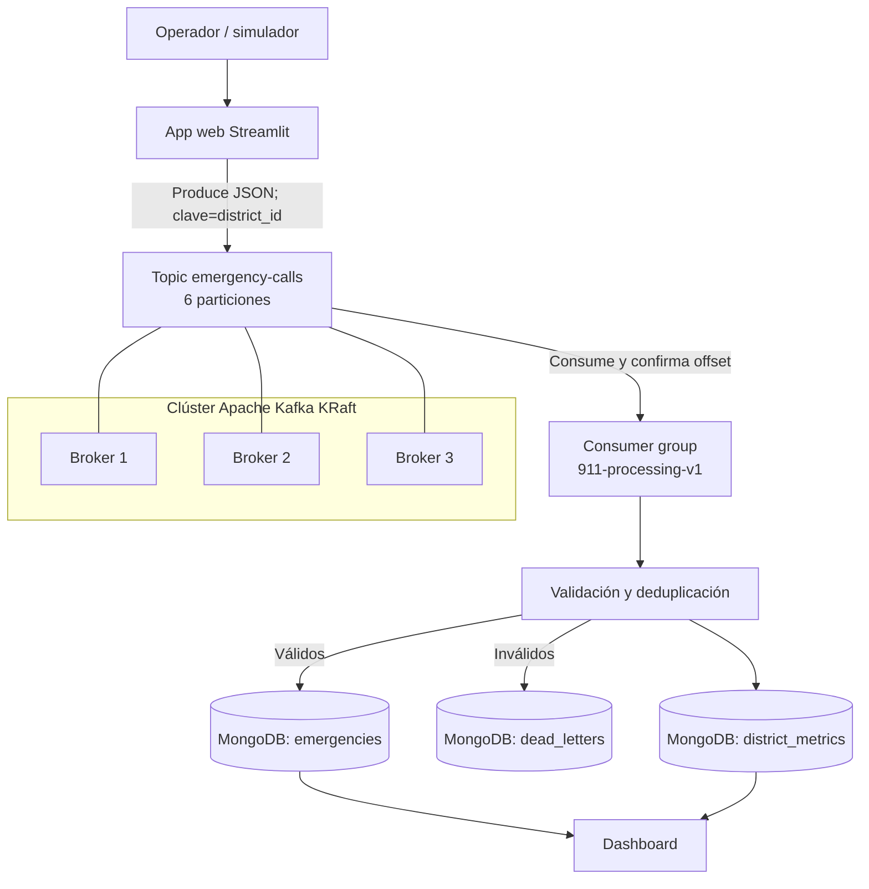

# Arquitectura de la Central de Emergencias 911

## Recorrido de un evento

1. Streamlit crea un JSON individual o un lote.
2. El productor utiliza `district_id` como clave.
3. Kafka calcula la partición y replica el evento en tres brokers.
4. El consumidor lee el evento y valida sus campos.
5. Los registros malformados van a `dead_letters`.
6. `report_number` evita almacenar duplicados.
7. El consumidor actualiza las métricas del distrito.
8. El dashboard consulta MongoDB y presenta el balance.

## Disponibilidad

- Replication factor: 3.
- `min.insync.replicas`: 2.
- Productor: `acks=all` e idempotencia.
- El sistema tolera la caída de un broker mientras dos réplicas continúen sincronizadas.
- Los offsets solo se confirman después de procesar el evento.

