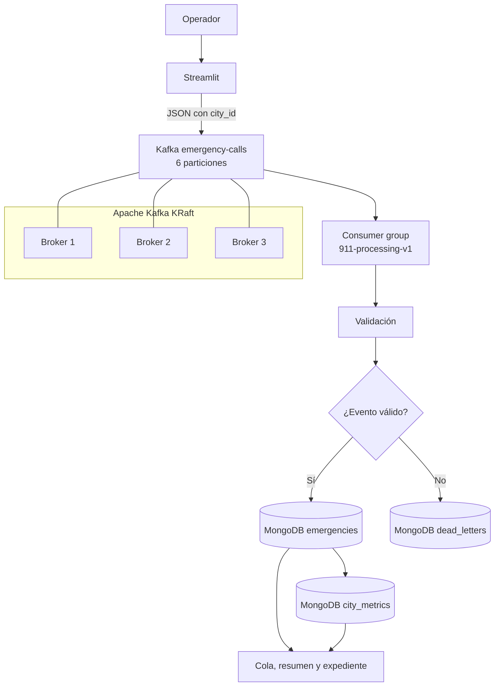

# Arquitectura de la Central de Emergencias 911

## Vista general

La solución separa la experiencia del operador del procesamiento distribuido. Streamlit recibe la acción, Kafka funciona como buffer durable y MongoDB conserva el estado operativo que consulta la central.

## Modelo operativo

El dominio tiene tres ciudades: Tegucigalpa, San Pedro Sula y La Ceiba. Los eventos se distribuyen por `city_id`, no por distritos.

Cada evento contiene:

- `report_number`
- `city_id` y `city_name`
- `neighborhood`
- `location`
- `emergency_type`
- `priority` de 1 a 5
- `description`
- `people_at_risk`
- `status`
- `assigned_units`
- `occurred_at`

## Recorrido de un evento

1. Streamlit crea un evento individual o un lote.
2. El productor publica el JSON con `city_id` como clave.
3. Kafka replica el mensaje en tres brokers.
4. El consumidor valida los campos obligatorios.
5. Los eventos inválidos se guardan en `dead_letters`.
6. Los válidos se insertan en `emergencies`.
7. El índice único de `report_number` evita duplicados cuando Kafka reentrega un mensaje.
8. MongoDB actualiza métricas por ciudad.
9. La interfaz consulta MongoDB para mostrar cola, paginación, resumen y despacho.

## Decisiones de disponibilidad

- Tres brokers en modo KRaft.
- Factor de replicación 3.
- `min.insync.replicas=2`.
- Productor con `acks=all` e idempotencia.
- Confirmación manual de offsets.
- MongoDB como almacenamiento documental para mantener flexible el esquema de los reportes.

