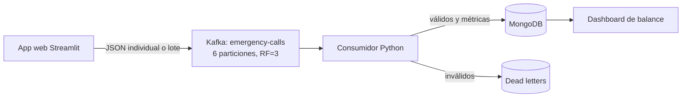

# Central de Emergencias 911

Proyecto integrador de Big Data que genera, ingiere, procesa, almacena y visualiza llamadas de emergencia en tiempo real.

## Qué demuestra

- Generación individual y masiva de eventos realistas.
- Escenarios de operación normal, accidente múltiple, tormenta y evento masivo.
- Medición del throughput en eventos por segundo.
- Topic Kafka particionado por distrito.
- Clúster Kafka KRaft de tres brokers y replicación 3.
- Productor idempotente con `acks=all`.
- Consumidor con confirmación manual de offsets.
- Validación, deduplicación y dead-letter collection.
- Almacenamiento documental en MongoDB.
- Balance de carga por distrito y nivel de exposición.
- Interfaz Streamlit con login, centro de control y expediente de emergencia.

## Arquitectura



La clave de partición es `district_id`. Así se conserva el orden de los eventos de cada distrito y distintos distritos se procesan en paralelo.

## Requisitos

- Docker Desktop o Docker Engine con Compose.
- Aproximadamente 4 GB de RAM libres.
- Puertos locales disponibles para Docker y el puerto `8501` para la interfaz.

## Ejecución rápida

Desde la carpeta del proyecto:

```bash
docker compose up --build -d
```

Compruebe el estado:

```bash
docker compose ps
```

Abra:

```text
http://localhost:8501
```

Credenciales de demostración:

```text
Usuario: Alejandro
Contraseña: 911
```

Para observar el consumidor:

```bash
docker compose logs -f consumer
```

Para detener el sistema sin borrar los datos:

```bash
docker compose down
```

Para borrar todos los contenedores y el volumen de MongoDB:

```bash
docker compose down -v
```

## Demostración recomendada

1. Inicie sesión.
2. Registre una emergencia individual.
3. Muestre cómo aparece procesada en el centro de control.
4. Abra su expediente, asigne una unidad y cambie el estado.
5. Abra **Generador masivo** y envíe 1,000 llamadas con 2% de imperfecciones.
6. Muestre el throughput obtenido.
7. Abra **Balance por distrito** y seleccione el distrito que indique el docente.
8. Explique los eventos rechazados y la deduplicación.

## Modelo del evento

```json
{
  "schema_version": 1,
  "report_number": "EM-A1B2C3D4",
  "district_id": "D01",
  "district_name": "Distrito Centro",
  "emergency_type": "Accidente vehicular",
  "priority": 4,
  "location": "Avenida principal, sector 1",
  "description": "Colisión vehicular reportada por ciudadanos",
  "occurred_at": "2026-08-03T20:00:00+00:00",
  "status": "Recibida",
  "assigned_unit": null,
  "operator": "Alejandro",
  "source": "central-911-generator"
}
```

## Fórmula del balance

```text
balance = unidades_disponibles - llamadas_activas
carga = llamadas_activas / unidades_disponibles
```

- `carga < 0.60`: Estable.
- `0.60 <= carga <= 1.00`: Atención.
- `carga > 1.00`: Crítica.

## Pruebas

En un entorno Python local:

```bash
python -m venv .venv
source .venv/bin/activate
pip install -r requirements.txt
pytest -q
```

## Estructura

```text
src/app.py             Interfaz y visualización
src/event_factory.py   Generación realista e imperfecciones
src/kafka_io.py        Productor Kafka
src/consumer.py        Consumidor y control de offsets
src/processor.py       Validación y cálculo de exposición
src/storage.py         MongoDB, deduplicación y agregaciones
tests/                 Pruebas del generador y procesamiento
```
