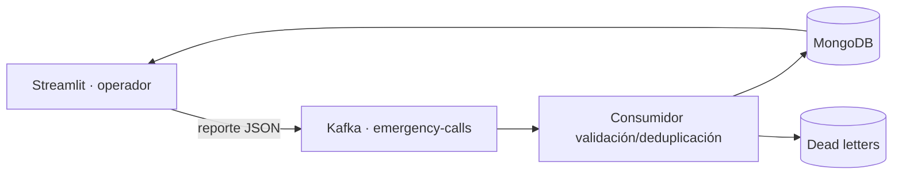

# Central de Emergencias 911 · Honduras

Central de despacho operativa para registrar, priorizar y atender emergencias en Tegucigalpa, San Pedro Sula y La Ceiba. El objetivo de la interfaz es que un operador pueda registrar un reporte crítico y abrir su despacho en menos de 15 segundos.

## Flujo operativo

1. El operador registra ciudad, colonia o referencia, ubicación, tipo, prioridad, descripción y personas en riesgo.
2. El reporte se publica en Kafka sin exponer infraestructura al operador.
3. El consumidor valida, deduplica y guarda el evento en MongoDB.
4. La cola permite buscar, filtrar por ciudad/tipo/prioridad/estado, ordenar y paginar más de 1,500 reportes.
5. El expediente permite asignar varias ambulancias, patrullas, bomberos y rescate.
6. Estados: **Nuevo**, **Despachado**, **En atención** y **Cerrado**.

## Resumen operativo

La central muestra reportes nuevos, críticos activos, unidades disponibles, unidades ocupadas y presión operativa por las tres ciudades.

## Arquitectura



Kafka usa `city_id` como clave de partición. El clúster conserva tres brokers KRaft, productor idempotente con `acks=all`, confirmación manual de offsets y seis particiones.

## Ejecución

Requisitos: Docker Desktop y aproximadamente 4 GB de RAM.

```bash
docker compose up --build -d
docker compose ps
```

Abrir `http://localhost:8501`. Credenciales demo: `Alejandro` / `911`.

Logs: `docker compose logs -f consumer`. Detener sin borrar datos: `docker compose down`. Borrar MongoDB: `docker compose down -v`.

## Generación masiva

La sección **Generación masiva** conserva escenarios de operación normal, accidente múltiple, tormenta severa y evento masivo. Permite generar hasta 50,000 reportes, medir throughput e introducir imperfecciones controladas.

## Pruebas

```bash
python -m venv .venv
source .venv/bin/activate
pip install -r requirements.txt
pytest -q
```

En Windows PowerShell: `.\\.venv\\Scripts\\Activate.ps1`.

## Estructura

`src/app.py` interfaz · `src/event_factory.py` datos hondureños y lotes · `src/processor.py` validación · `src/storage.py` MongoDB, filtros y métricas · `src/kafka_io.py` productor · `src/consumer.py` consumidor · `tests/` pruebas.

