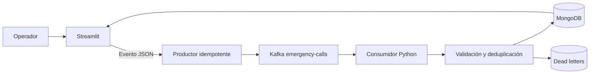

# Central de Emergencias 911 · Honduras

Este proyecto es una central de despacho para Honduras. La interfaz está pensada para que un operador pueda registrar una emergencia crítica, priorizarla y abrir su despacho en menos de 15 segundos.

No es un dashboard académico aislado: la operación completa está conectada a un pipeline de datos con Kafka, un consumidor Python y MongoDB. Kafka trabaja detrás de la interfaz; el operador solo necesita registrar y atender reportes.

## Qué resuelve

La central trabaja únicamente con:

- Tegucigalpa
- San Pedro Sula
- La Ceiba

Cada reporte contiene ciudad, colonia o referencia, ubicación, tipo de emergencia, prioridad, descripción y personas en riesgo.

El ciclo de atención usa cuatro estados:

**Nuevo → Despachado → En atención → Cerrado**

Desde el expediente se pueden asignar varias unidades a la vez: ambulancias, patrullas, bomberos y rescate.

## Flujo de un reporte

1. El operador registra la emergencia desde el formulario de acción rápida.
2. La aplicación genera el evento JSON y lo publica en Kafka.
3. El consumidor valida el esquema y envía los registros inválidos a dead letters.
4. MongoDB guarda los reportes válidos y evita duplicados mediante un índice único en `report_number`.
5. La cola permite buscar, filtrar, ordenar y paginar más de 1,500 reportes.
6. El operador abre el expediente, asigna varias unidades y actualiza el estado.
7. El resumen operativo muestra reportes nuevos, críticos, unidades disponibles, unidades ocupadas y presión por ciudad.

## Arquitectura actual



Kafka usa `city_id` como clave de partición. El clúster tiene tres brokers KRaft, seis particiones, factor de replicación 3 y mínimo de dos réplicas sincronizadas. El productor usa `acks=all` e idempotencia. El consumidor confirma el offset únicamente después de procesar el evento.

## Componentes

- `src/app.py`: login, cola, resumen por ciudad, generador y expediente de despacho.
- `src/event_factory.py`: datos de Honduras, escenarios y generación individual/masiva.
- `src/kafka_io.py`: productor Kafka y medición de throughput.
- `src/consumer.py`: consumidor con confirmación manual de offsets.
- `src/processor.py`: validación de eventos y cálculo de presión operativa.
- `src/storage.py`: MongoDB, paginación, filtros, deduplicación y métricas.
- `tests/`: pruebas del generador y la validación.
- `.streamlit/config.toml`: tema claro y barra de herramientas de producción.

## Ejecución con Docker

Requisitos: Docker Desktop, Compose y aproximadamente 4 GB de RAM.

```powershell
cd C:\Users\aleja\Downloads\Central_Emergencias_911_MVP
docker compose up --build -d
docker compose ps
```

Abrir:

```text
http://localhost:8501
```

Credenciales de demostración:

```text
Usuario: Alejandro
Contraseña: 911
```

Para reconstruir después de cambios de código:

```powershell
docker compose build --no-cache app consumer
docker compose up -d --force-recreate app consumer
```

Logs:

```powershell
docker compose logs -f consumer
docker compose logs --tail=200 app
```

Detener sin borrar datos:

```powershell
docker compose down
```

## Preparar una demostración

En **Generación masiva** está la opción **Eliminar datos de prueba**. Se debe confirmar explícitamente antes de borrar reportes, métricas y dead letters de MongoDB.

Después:

1. Registrar una emergencia crítica.
2. Abrir el reporte desde la cola.
3. Seleccionar varias unidades.
4. Cambiar el estado a Despachado.
5. Continuar a En atención.
6. Mostrar el resumen por ciudad.
7. Generar un lote de 1,500 reportes.
8. Usar búsqueda, filtros y paginación para demostrar la cola.

## Pruebas locales

```powershell
python -m venv .venv
.\.venv\Scripts\Activate.ps1
pip install -r requirements.txt
pytest -q
```

También se puede verificar la sintaxis sin instalar pytest:

```powershell
python -m compileall -q src tests
```

